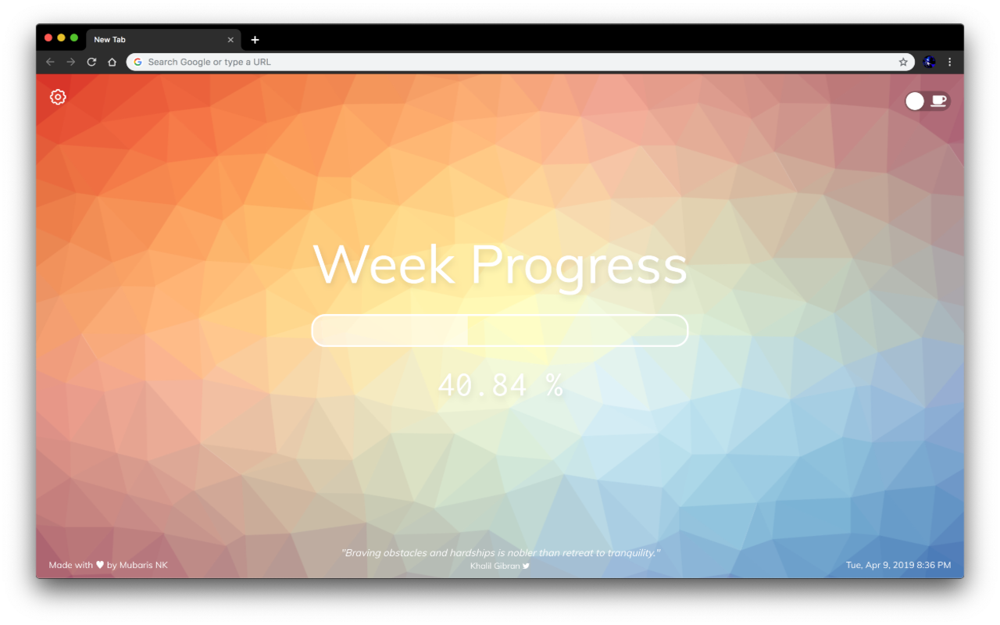
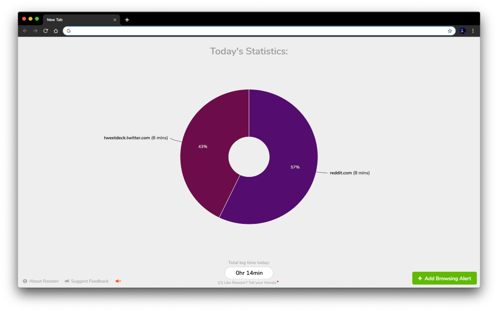
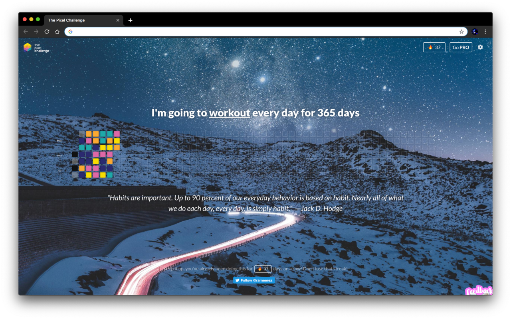

# multiple-new-tab

> Use Multiple New Tab Extensions for Chrome & Firefox 😜

Just a simple extension to use multiple new tabs in Chrome & Firefox (currently doesn't work for Firefox, see [#1](https://github.com/deadcoder0904/multiple-new-tab/issues/1)).

# Screenshots

# Description

Ever wanted to use Multiple Chrome New Tab extensions but couldn't find a way to use it?

This extension solves your exact same problem.

So now you can use Momentum, Toby, Progress Dash, Rooster, The Pixel Challenge, Muzli & many other cool New Tab extensions on your Chrome without hassle.

How does it do it?

What happens is a New Tab extension overrides the current New Tab.

So this extension enables a single extension at a time & disables the rest of the New Tab extensions.

At a time, there is only one New Tab extension enabled.

Credits to [Alexander Sideris](https://twitter.com/alexsideris_) for making it in the first place but it had some additional setup at the start.

I basically eliminated the starting setup after failing to understand why the extension didn't work the way it did.

Also, this is free & open-source.

You can view the entire source code here to confirm I'm not doing anything malicious 😂

https://github.com/deadcoder0904/multiple-new-tab

# Credits

[Alexander Sideris](https://twitter.com/alexsideris_) made it first but it had some configuration to set it up instead of directly working.

So I made this simple thing in which you wouldn't need to set up anything. All your New Extensions will be rotated everytime you create a New Tab. Its also took me <50 LOCs so wasn't too hard to build :)
